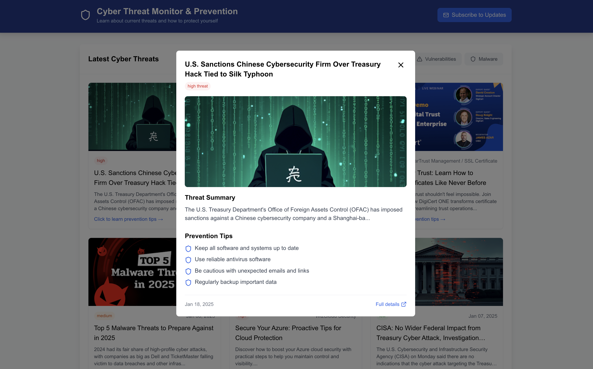
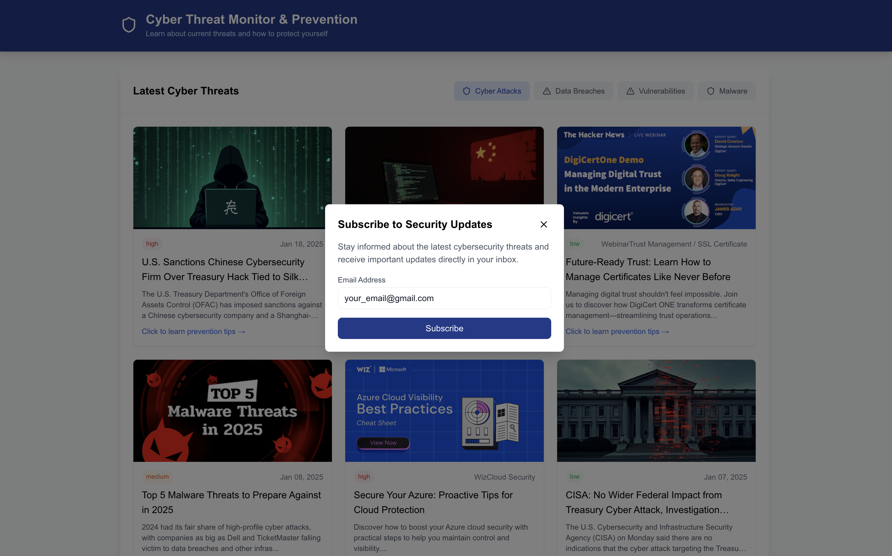

# CyberGuard 🛡️

As the digital world continues to grow, cyber threats are becoming increasingly common, yet many people remain unaware of these dangers due to limited coverage or accessibility to relevant information. That’s why we created CyberGuard — an all-in-one newsletter dashboard that delivers the latest news on cyber threats. CyberGuard not only keeps you informed about recent attacks but also provides practical tips for prevention, empowering users with the knowledge to enhance their cybersecurity awareness and stay protected.

## Features ✨  
- **Real-Time Cyber News:** Gain instant access to updates on malware, data breaches, and emerging threats.
- **Tailored Alerts:** Subscribe to personalized email notifications to stay informed about relevant threats.
- **Educational Insights:** Learn effective prevention methods to enhance cybersecurity awareness.

## Screenshots 📸  
- **Dashboard Overview:**


- **Detailed Threat Insights::**


- **Email Subscription Feature:**


## Technologies Used 🛠️  

### **Frontend**  
- TypeScript  
- React.js  
- Next.js  
- Tailwind CSS  

### **Backend**  
- Python  
- Express.js  

## Installation & Setup ⚙️  

1. **Clone the Repository**  
   ```bash  
   git clone https://github.com/wenzhaopan/CyberGuard.git  
   cd CyberGuard

2. **Install Dependencies**
   ```bash
   npm install

3. **Run the Backend Server**
   ```bash
   cd backend
   node server.js

4. **Start the Frontend**
   ```bash
   cd frontend
   npm run dev

## Usage 💻

- Open the app at http://localhost:3000 after starting the server.
- Explore real-time news and insights on cyber threats.
- Subscribe to receive personalized email alerts for the latest cybersecurity updates.
  
